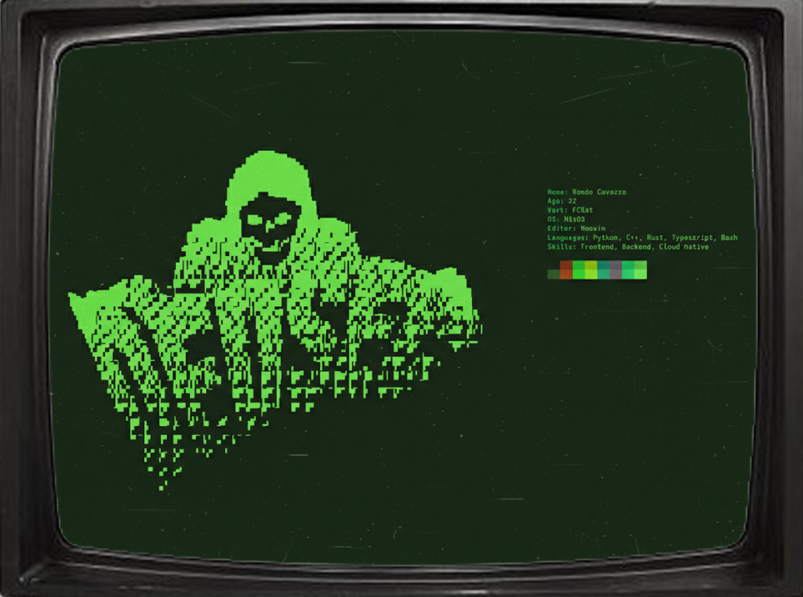

  

<h1 align="center">Roméo Cavazza</h1>

  <strong>AI-Powered Software Engineering</strong> 
  Bridging the gap between Low-level Engineering & High-level AI. 

  
  
  
  
  

---

## Tech Stack

---
## Wakatime

## GitHub Stats

  

